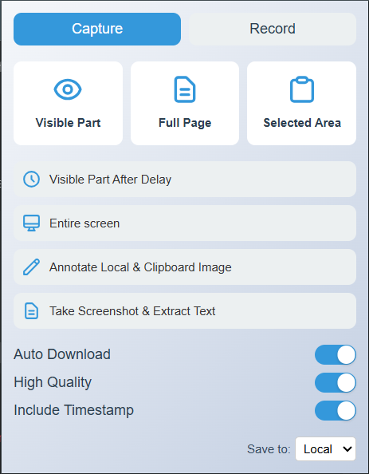

# 📸 Quick Capture - Screenshot & Annotation Chrome Extension

Quick Capture is a powerful and elegant Chrome extension designed to enhance your browsing experience by allowing you to take screenshots of your browser. Capture the visible area, full page, or a selected region, annotate images, extract text from screenshots, and more, all from a user-friendly popup interface.

## 🚀 Features

- ✅ Capture the **visible part** of the tab
- ✅ Capture the **full webpage**, including scrolling
- ✅ Capture a **selected area**
- ✅ **Delay capture** for timed screenshots
- ✅ Capture the **entire screen** (beyond the browser)
- ✅ Annotate **clipboard or local images**
- ✅ **OCR support**: Extract text from screenshots
- ✅ Customizable options for:
  - Auto Download
  - High Quality
  - Include Timestamp
  - Save to Local or Cloud (future feature)

> ✨ **Recording support coming soon!**

## 🛠️ Tech Stack

- **Manifest V3**
- **JavaScript** (Plain)
- **HTML5 + CSS3**
- **html2canvas** for rendering screenshots
- **Chrome Extension APIs**:
  - `activeTab`
  - `tabs`
  - `scripting`
  - `downloads`
  - `debugger`
  - `storage`
- Background worker via `service_worker`

## 📂 Project Structure

```
quick-capture-extension/
├── manifest.json
├── popup.html
├── popup.js
├── popup.css
├── background.js
├── html2canvas.min.js
├── icon16.png
├── icon48.png
├── icon128.png
└── README.md
```

## 🧑‍💻 Getting Started (For Developers)

### 1. Clone the Repository

```bash
git clone https://github.com/your-username/quick-capture-extension.git
cd quick-capture-extension
```

### 2. Load the Extension in Chrome

1. Open Chrome and navigate to: `chrome://extensions/`
2. Enable **Developer mode** (top right)
3. Click **Load Unpacked**
4. Select the `quick-capture-extension/` directory

### 🧪 Development Notes

- Ensure `html2canvas.min.js` is accessible via `web_accessible_resources`.
- Customize your UI in `popup.html` and `popup.css`.
- Handle background logic (future features like recording) in `background.js`.
- Use Chrome’s Developer Tools → Extensions tab for debugging service workers.

### 🌐 Permissions Explained

| Permission         | Purpose                                      |
| ------------------ | -------------------------------------------- |
| `activeTab`        | Access the currently active tab              |
| `tabs`             | Manage and query browser tabs                |
| `scripting`        | Execute content scripts                      |
| `downloads`        | Save screenshots to local machine            |
| `debugger`         | (For future advanced screen recording/debug) |
| `storage`          | Store user settings                          |
| `host_permissions` | Allow all URLs for universal access          |

## 📦 Build / Package Instructions

This project is intended to run as-is without a build step. Just ensure:

- All files are present
- PNG icons are in place
- Scripts/styles are referenced correctly in `popup.html` and `manifest.json`

## 📸 Screenshots



## 🤝 Contributing

Pull requests are welcome! For major changes, please open an issue first to discuss your ideas.

[](https://github.com/nutanmishra/quick-capture-extension/graphs/contributors)

### Ideas to Contribute:

- Add recording support
- Integrate cloud upload (e.g., Google Drive)
- Add annotation tools directly
- Implement keyboard shortcuts

## 📄 License

This project is licensed under the MIT License.

## 👤 Author

**Nutan Mishra**  
🔗 [LinkedIn](https://www.linkedin.com/in/nutan-mishra-86969411b/)  
💼 Open to collaboration & improvements!

---

### Additional Requests

Let me know if you'd like:

- Badges (MIT license, Chrome Web Store status, etc.)
- Screenshot previews or demo video
- GitHub Actions for formatting/testing
- License file (`MIT`)
- Contribution guidelines (`CONTRIBUTING.md`)

Would you like help setting up the repo structure with these files too?
